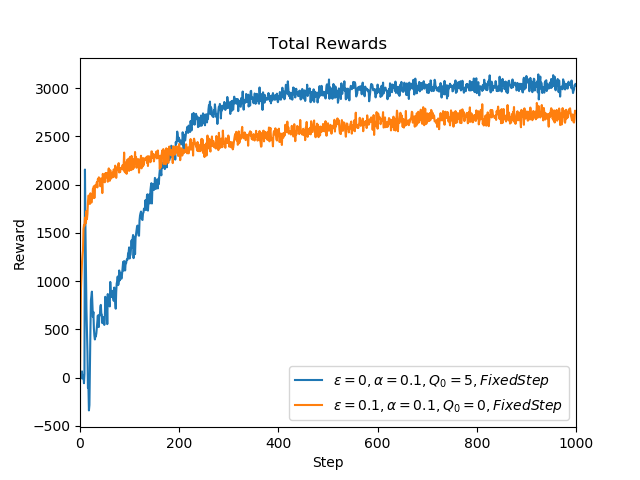
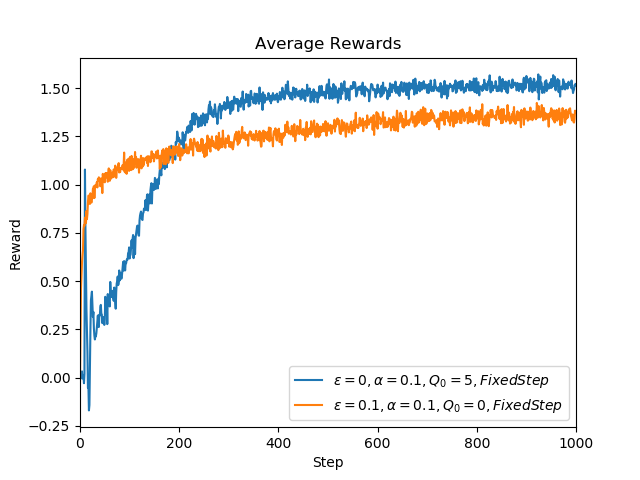
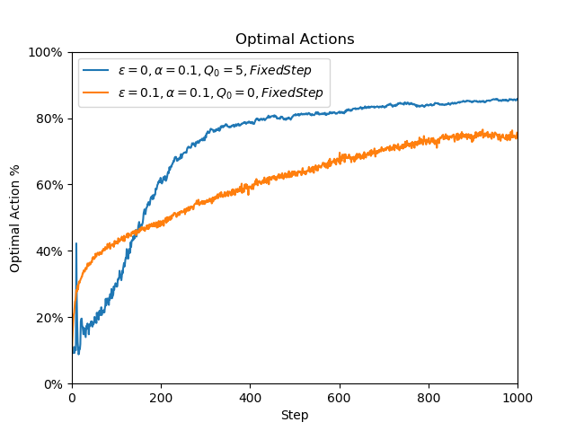
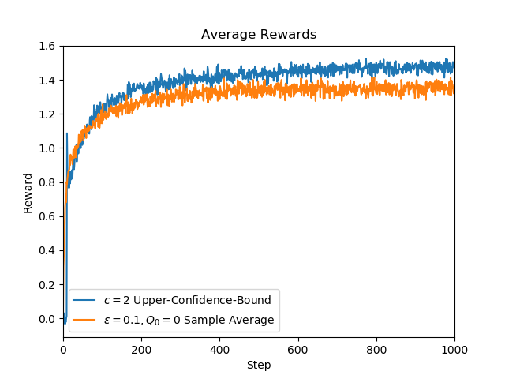
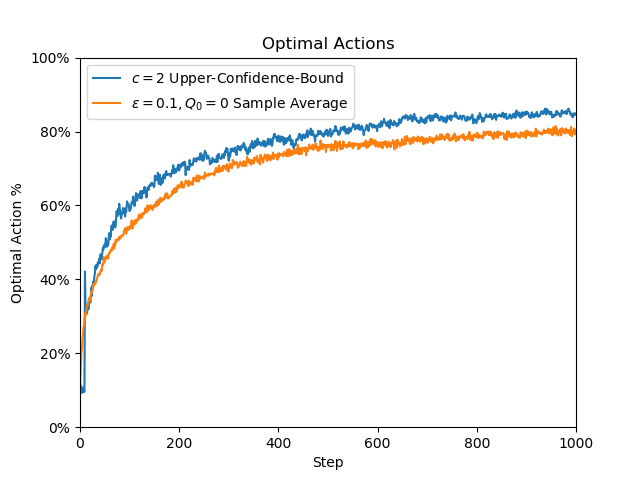
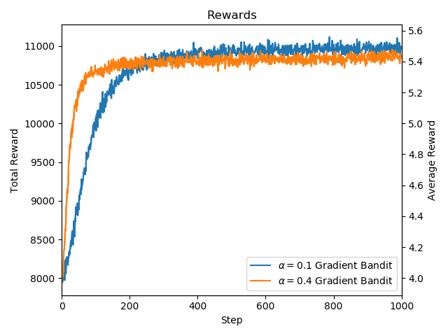
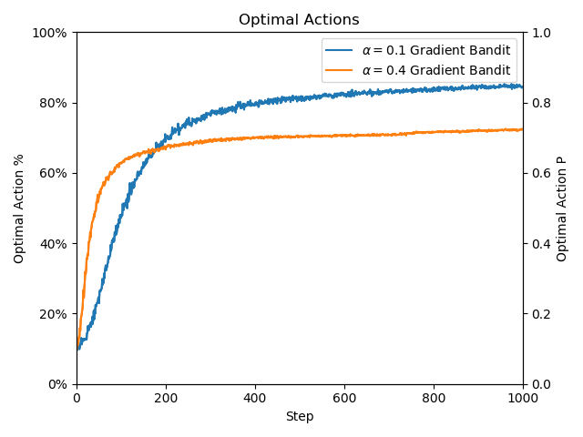
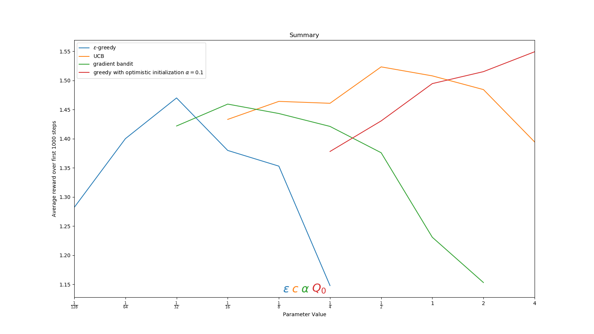

# Experiments for Multi-Armed bandits

## Stationary problem

Tests are made with action value sample-average agents for ε = `0.1`, `0.01`, `0.001` and `0`

## Non-stationary problem

Tests made with two agents:
 - Agent with standard sample-average action value with ε = `0.1`
 - Agent with fixed step-size α = `0.1` and ε = `0.1`

We can see that the fixed-step agent performed better for a non-stationary problem.

## ucb Initial Values

Two constant step agents with α = `0.1`:
- One greedy (ε = `0`) and optimistic initial value = `5`
- One ε-greedy (ε = `0.1`)

It is clear that the optimistic initial values agent performs better in the long run for stationary problems.

## Upper-Confidence-Bound

## Gradient Bandits with baseline

## Summary

Summary of several different agents over a range of hyperparameters

